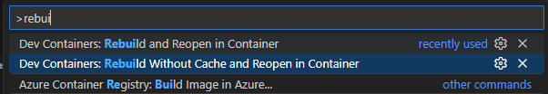

# My-First-Chip-2026


## Setup

### With VSCode devcontainer

#### Dependencies

1. Docker desktop
2. X11 server

#### Intructions

1. Open the this repo in VSCode and then with ```CTRL+SHIFT+P``` open the Command Pallete


2. Once inside the devcontainer you start the librelane nix shell with this command:

```
cd librelane
nix develop
```

3. After several minutes everyting is going to be installed and you can run the smoke-test:

```
librelane --smoke-test
```

### With nix shell

Follow this instructions: [librelane instalation](https://librelane.readthedocs.io/en/stable/installation/nix_installation/index.html)

## Running the examples

### Example 1: Librelane classic flow

1. To run the flow
```
cd exercises/librelane-classic
make librelane
```
2. To view the results
```
make view-results
```

### Example 1: Librelane chip flow
1. To run the flow
```
cd exercises/librelane-chip
make librelane
```
2. To view the results
```
make view-results
```
